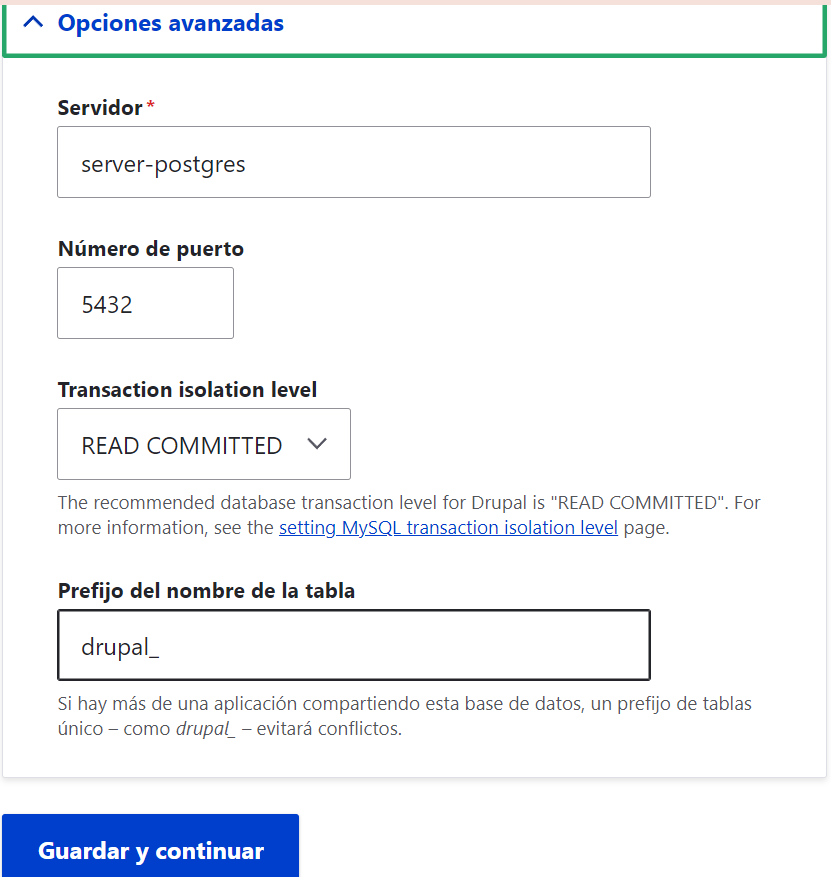

## VOLUMEN NOMBRADO
Un volumen nombrado (named volume) es un tipo de volumen gestionado por Docker que se almacena en una ubicación específica del sistema de archivos del host y se identifica mediante un nombre único. Los volúmenes nombrados no requieren que especifiques una ruta del sistema de archivos del host, y en su lugar, Docker se encarga de la gestión y el almacenamiento del volumen.


### Crear volumen
```
docker volume create <nombre volumen>
```

### Crear el volumen nombrado: vol-postgres
# 
```
PS C:\Users\PC> docker volume create vol-postgres>>
vol-postgres
```

## MOUNTPOINT
Un mountpoint se refiere al lugar en el sistema de archivos donde un dispositivo de almacenamiento se une (o monta) al sistema de archivos. Es el punto donde los archivos y directorios almacenados en ese dispositivo de almacenamiento son accesibles para el sistema operativo y las aplicaciones.

Por ejemplo, en Windows las unidades de almacenamiento (como `C:`, `D:`, etc.) actúan como puntos de montaje principales para discos duros, unidades flash, unidades ópticas y otros dispositivos de almacenamiento.

Cuando creas un volumen nombrado, Docker asigna un punto de montaje específico en el sistema de archivos del host para ese volumen.

### ¿Cuál es el Mountpoint de vol-postgres?
#### Gestionada automáticamente por Docker y puede variar según el sistema.Este comando "docker volume inspect vol-postgres te mostrará información detallada sobre el volumen, incluyendo su punto de montaje en el sistema de archivos del host. En la salida, busca el campo "Mountpoint", que te indicará la ubicación donde Docker ha montado el volumen vol-postgres.

### Estructura del Punto de Montaje:
- /var/lib/docker/volumes/: Es la ubicación base donde Docker almacena todos los volúmenes en el sistema de archivos del host.
- nombreVolumen/: Es el nombre del volumen nombrado que has creado. Docker crea un directorio con este nombre dentro de /var/lib/docker/volumes/ para almacenar los datos del volumen.
- _data: Es el subdirectorio dentro de vol-postgres/ donde se almacenan los datos reales del volumen. El nombre _data es una convención utilizada por Docker para indicar el directorio donde se encuentran los datos del volumen.

### ¿Cómo acceder a ese Mountpoint?
En el contexto de WSL (Windows Subsystem for Linux), wsl$ se refiere al nombre de un recurso compartido de red especial que representa la raíz del sistema de archivos de Windows desde WSL. Cuando accedes a \\wsl$ desde el Explorador de archivos de Windows, puedes ver y acceder a los archivos del sistema de archivos de la distribución de Linux en WSL.
\\wsl.localhost\docker-desktop-data\data\docker\volumes

### Crear un contenedor vinculado a un volumen nombrado
```
docker run -d --name <nombre contenedor> -v <nombre volumen>:<ruta contenedor> <nombre imagen>
```

### Crear la red net-drupal de tipo bridge
####
```
PS C:\Users\PC> docker network create --driver bridge net-drupal
>>
9e8c62dc51f3296f00c43bc51fbac6521c33fc184b2459a9a547895a80f20ac8
PS C:\Users\PC>
 ```

### Crear un servidor postgres vinculado a la red net-drupal, completar la ruta del contenedor
```
docker run -d --name server-postgres -e POSTGRES_DB=db_drupal -e POSTGRES_PASSWORD=12345 -e POSTGRES_USER=user_drupal --network net-drupal postgres
```
_No es necesario exponer el puerto, debido a que nos vamos a conectar desde la misma red de docker_

### Crear un cliente postgres vinculado a la red drupal a partir de la imagen dpage/pgadmin4, completar el correo
```
docker run -d --name client-postgres --publish published=9500,target=80 -e PGADMIN_DEFAULT_PASSWORD=54321 -e PGADMIN_DEFAULT_EMAIL=<correo> --network net-drupal dpage/pgadmin4
```

### Usar el cliente postgres para conectarse al servidor postgres, para la conexión usar el nombre del servidor en lugar de la dirección IP.

### Crear los volúmenes necesarios para drupal, esto se puede encontrar en la documentación
####
```
PS C:\Users\PC> docker volume create drupal_data
drupal_data
PS C:\Users\PC> docker volume create drupal_modules
drupal_modules
PS C:\Users\PC> docker volume create drupal_files
drupal_files
PS C:\Users\PC> docker run -d --name server-drupal --network net-drupal `
>>     -p 9700:80 `
>>     -v drupal_data:/var/www/html/sites/default/files `
>>     -v drupal_modules:/var/www/html/modules `
>>     -v drupal_files:/var/www/html/sites `
>>     drupal:latest
>>
Unable to find image 'drupal:latest' locally
latest: Pulling from library/drupal
36d4eb215a4a: Pulling fs layer                                                                            
36d4eb215a4a: Download complete
afd6dcf9c5c4: Download complete
d9c650d17537: Download complete
8c2340e96d81: Download complete
4f4fb700ef54: Already exists
e09dc258c322: Download complete
e2133690866d: Download complete
303bb1c6136b: Download complete
d971a9a94f20: Download complete
6c8db7ba2fb3: Download complete
a4e31c3cda9f: Download complete
b9dd36c07ca0: Download complete
d404a37f1ede: Download complete
8dd95df71d95: Download complete
e299a01471fd: Download complete
cc383c045d44: Download complete
eab50bae3de5: Download complete
Digest: sha256:2ddf0cc0606d88b5f406c858a85ecb9ed75a03cdb70b46b325106cf91adbb50d
Status: Downloaded newer image for drupal:latest
c94ae5de88530952cc7cce04cf1c7cd53efb89c00c764fea0765d8d3b16c3ee8
PS C:\Users\PC>
```

### Crear el contenedor server-drupal vinculado a la red, usar la imagen drupal, y vincularlo a los volúmenes nombrados
```
docker run -d --name server-drupal --publish published=9700,target=80 -v <nombre volumen>:<ruta contenedor> -v <nombre volumen>:<ruta contenedor> -v <nombre volumen>:<ruta contenedor> -v <nombre volumen>:<ruta contenedor> --network net-drupal drupal
```

### Ingrese al server-drupal y siga el paso a paso para la instalación.
# 



_La instalación puede tomar varios minutos, mientras espera realice un diagrama de los contenedores que ha creado en este apartado._

# COMPLETAR CON EL DIAGRAMA SOLICITADO

### Eliminar un volumen específico
```
docker volume rm <nombre volumen>
```
**Considerar**
Datos Persistentes: Asegúrate de que el volumen no contiene datos críticos antes de eliminarlo, ya que esta operación no se puede deshacer.
Contenedores Activos: No puedes eliminar un volumen que está actualmente en uso por un contenedor activo. Debes detener y/o eliminar el contenedor primero.
